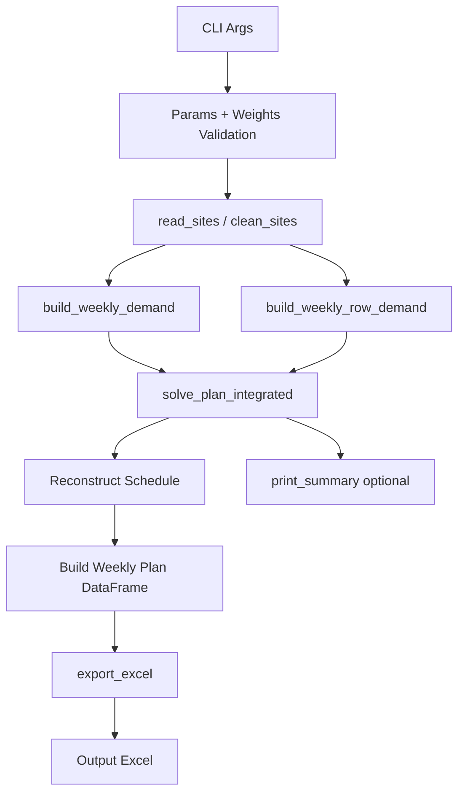

# Design Document: Integrated Cost Optimization Model

## Overview

A new standalone Python script (`integrated_cost_optimizer.py`) that plans weekly
production by minimizing a **weighted composite cost function** combining three components:

- **Penalty Cost** — early inventory holding cost ($7,000/unit-week) or last-resort backlog cost (10× multiplier)
- **Overtime Cost** — cost per week a 3rd batch is run ($2,000/week)
- **Capacity Utilization Cost** — cost per unused good unit slot per week (default $0, user-defined)

Each component has a user-defined weight (0.0–1.0). Setting a weight to 0 disables that
component entirely. The optimizer uses Dynamic Programming to find the globally optimal
52-week production schedule.

---

## Architecture



---

## Components and Interfaces

### 1. `IntegratedParams` (dataclass)

Extends the existing `Params` with cost weights and rates:

```python
@dataclass(frozen=True)
class IntegratedParams:
    # Inherited production constraints
    horizon_weeks: int = 52
    min_batch_produced: int = 2
    max_batch_produced: int = 16
    test_discard_per_batch: int = 1
    normal_max_batches: int = 2
    overtime_max_batches: int = 3

    # Cost rates
    penalty_rate: float = 7000.0        # USD per unit-week early inventory
    late_penalty_multiplier: float = 10.0  # multiplier for backlog penalty
    overtime_rate: float = 2000.0       # USD per overtime week (3rd batch)
    capacity_rate: float = 0.0          # USD per unused good unit slot

    # Weights (0.0 to 1.0)
    w_penalty: float = 1.0
    w_overtime: float = 1.0
    w_capacity: float = 0.0

    # Derived
    @property
    def late_penalty_rate(self) -> float:
        return self.penalty_rate * self.late_penalty_multiplier

    @property
    def max_good_per_batch(self) -> int:
        return self.max_batch_produced - self.test_discard_per_batch  # 15

    @property
    def normal_max_good_week(self) -> int:
        return self.normal_max_batches * self.max_good_per_batch  # 30

    @property
    def overtime_max_good_week(self) -> int:
        return self.overtime_max_batches * self.max_good_per_batch  # 45
```

### 2. `WeeklyCost` (dataclass)

Holds the per-week cost breakdown:

```python
@dataclass
class WeeklyCost:
    penalty_cost: float
    overtime_cost: float
    capacity_cost: float

    @property
    def composite(self, w_p, w_o, w_c) -> float:
        return w_p * self.penalty_cost + w_o * self.overtime_cost + w_c * self.capacity_cost
```

### 3. `compute_weekly_cost(inv_end, good_prod, week_type, params)` → `float`

Core cost function used inside the DP:

```python
def compute_weekly_cost(inv_end, good_prod, week_type, params):
    # Penalty component
    if inv_end >= 0:
        penalty = params.penalty_rate * inv_end
    else:
        penalty = params.late_penalty_rate * abs(inv_end)

    # Overtime component
    overtime = params.overtime_rate if good_prod > params.normal_max_good_week else 0.0

    # Capacity utilization component
    if week_type == "Shutdown":
        capacity = 0.0
    elif week_type == "Partial":
        capacity = params.capacity_rate * max(0, params.max_good_per_batch - good_prod)
    else:
        capacity = params.capacity_rate * max(0, params.normal_max_good_week - good_prod)

    # Weighted composite
    return (params.w_penalty * penalty +
            params.w_overtime * overtime +
            params.w_capacity * capacity)
```

### 4. `solve_plan_integrated(d, shutdown_weeks, partial_shutdown_weeks, row_demand, row_cap, params)` → `(DataFrame, summary_dict)`

Main DP solver. Returns the weekly plan DataFrame and a cost summary dict.

### 5. `export_excel(...)` → None

Writes output Excel with sheets: Weekly_Plan, Sites_Clean, Input_Issues, Model_Params.

---

## Data Models

### DP State

```
State:  inv (integer) = net inventory at end of week t
        inv >= 0 → early units held
        inv < 0  → backlog (last resort, penalized at 10× rate)

Transition:
        inv_new = inv_prev + y - demand[t]
        where y = good units produced in week t

Terminal:
        inv[52] = 0  (all demand satisfied by end of horizon)
```

### DP Value

```
dp[inv] = minimum composite cost to reach inventory state inv at end of current week
```

A single float (not a tuple) because the composite cost formula already combines all
components into one scalar. Tie-breaking uses a secondary tuple:

```
dp[inv] = (composite_cost, overtime_weeks, total_batches)
```

### Capacity Per Week

```
cap_max[t] = 0   if t in shutdown_weeks
           = 15  if t in partial_shutdown_weeks
           = 45  otherwise
```

### Inventory Bounds (Pruning)

```
ub[t] = sum(demand[t+1..T])          # max useful inventory
lb[t] = sum(demand[t+1..T]) - sum(cap[t+1..T])  # min inventory (can go negative for backlog)
```

Note: Unlike the existing planner, lb[t] can be negative here since backlog is allowed
as a last resort.

---

## Composite Cost Formula

```
Weekly_Composite_Cost(t) =
    w_penalty  × Penalty_Cost(t)
  + w_overtime × Overtime_Cost(t)
  + w_capacity × Capacity_Cost(t)

Where:
  Penalty_Cost(t)  = penalty_rate × inv_end(t)          if inv_end >= 0
                   = late_penalty_rate × |inv_end(t)|   if inv_end < 0

  Overtime_Cost(t) = overtime_rate   if good_units(t) > 30
                   = 0               otherwise

  Capacity_Cost(t) = capacity_rate × max(0, ceiling(t) - good_units(t))
                   where ceiling(t) = 30 (normal), 15 (partial), 0 (shutdown)

Total_Composite_Cost = Σ Weekly_Composite_Cost(t) for t = 1..52
```

### Weight Behavior Examples

| Scenario | w_penalty | w_overtime | w_capacity | Effect |
|----------|-----------|------------|------------|--------|
| Penalty only | 1.0 | 0.0 | 0.0 | Minimize early inventory, ignore overtime |
| Overtime only | 0.0 | 1.0 | 0.0 | Minimize 3rd batch weeks, ignore inventory |
| Smooth production | 0.0 | 0.0 | 1.0 | Fill idle weeks, ignore penalty/overtime |
| Balanced | 1.0 | 1.0 | 1.0 | Minimize all three equally |
| Penalty + overtime | 1.0 | 1.0 | 0.0 | Default behavior |

---

## Correctness Properties

*A property is a characteristic or behavior that should hold true across all valid
executions of a system — essentially, a formal statement about what the system should do.
Properties serve as the bridge between human-readable specifications and
machine-verifiable correctness guarantees.*

### Property 1: Composite cost formula correctness
*For any* inventory level, production level, week type, and weight combination,
the computed composite cost must equal exactly:
`w_penalty × penalty_cost + w_overtime × overtime_cost + w_capacity × capacity_cost`
**Validates: Requirements 1.1**

### Property 2: Zero weight excludes component
*For any* production plan, if a weight is set to 0.0, that component's contribution
to composite cost must be exactly 0.0 regardless of its raw cost value.
**Validates: Requirements 1.3**

### Property 3: Weight validation rejects out-of-range values
*For any* weight value outside [0.0, 1.0], the model must raise a validation error
before running the optimizer.
**Validates: Requirements 1.5, 1.6**

### Property 4: Penalty cost formula correctness
*For any* inventory value, penalty cost must equal `penalty_rate × inv` when inv >= 0,
and `late_penalty_rate × |inv|` when inv < 0, where late_penalty_rate = multiplier × penalty_rate.
**Validates: Requirements 2.1, 2.2**

### Property 5: Overtime cost formula correctness
*For any* production level, overtime cost must equal `overtime_rate` when good_units > 30,
and 0 otherwise.
**Validates: Requirements 3.1, 3.4**

### Property 6: Capacity utilization cost formula correctness
*For any* production level and week type, capacity cost must equal
`capacity_rate × max(0, ceiling - good_units)` where ceiling is 30 (normal),
15 (partial shutdown), or 0 (shutdown).
**Validates: Requirements 4.1, 4.4, 4.5, 4.6**

### Property 7: Production constraints satisfied
*For any* week in the output plan, good_units must be within [0, cap_max[t]] where
cap_max is 0 for shutdown, 15 for partial shutdown, and 45 for normal weeks.
Additionally, all batch sizes must be in [2, 16].
**Validates: Requirements 6.1, 6.2, 6.3, 6.4, 6.5, 6.6**

### Property 8: Terminal inventory constraint
*For any* valid output plan, Net_Inventory_End at week 52 must equal exactly 0.
**Validates: Requirements 5.5**

### Property 9: No backlog when early production is feasible
*For any* scenario where total capacity across all non-shutdown weeks exceeds total demand,
the optimizer must produce a plan with no backlog (all Net_Inventory_End >= 0).
**Validates: Requirements 5.6, 2.3**

### Property 10: Output contains all required cost columns
*For any* output plan DataFrame, all required columns must be present including
Penalty_Cost_USD, Overtime_Cost_USD, Capacity_Utilization_Cost_USD,
Composite_Cost_USD, Cumulative_Composite_Cost_USD.
**Validates: Requirements 9.3**

---

## Error Handling

| Condition | Behavior |
|-----------|----------|
| All weights = 0.0 | Raise ValueError before running DP |
| Weight outside [0.0, 1.0] | Raise ValueError with which weight is invalid |
| Missing required columns | Raise ValueError listing missing columns |
| No feasible DP states at week t | Raise RuntimeError identifying week t |
| No solution at week 52 with inv=0 | Raise RuntimeError |
| Batch size out of bounds | Raise ValueError (internal sanity check) |

---

## Testing Strategy

### Unit Tests
- Test `compute_weekly_cost` with specific inventory/production/week_type combinations
- Test weight=0 produces 0 contribution for that component
- Test all-zero weights raises error
- Test out-of-range weights raise error
- Test missing columns raises error
- Test backlog scenario: construct infeasible-early case, verify plan has backlog not error

### Property-Based Tests (using `hypothesis` library)

Each property test runs minimum 100 iterations with randomized inputs.

- **Property 1**: Generate random (inv, good_prod, week_type, weights), verify composite formula
- **Property 2**: Generate random plans with one weight=0, verify that component = 0 in composite
- **Property 3**: Generate weights outside [0,1], verify error raised
- **Property 4**: Generate random inventory values, verify penalty formula
- **Property 5**: Generate random production levels, verify overtime formula
- **Property 6**: Generate random (production, week_type, capacity_rate), verify capacity formula
- **Property 7**: Run solver on random demand/shutdown configs, verify all output production values within bounds
- **Property 8**: Run solver on random demand configs, verify week 52 inventory = 0
- **Property 9**: Run solver on feasible-early configs, verify no backlog in output
- **Property 10**: Run solver, verify all required columns present in output DataFrame

Tag format: `# Feature: integrated-cost-optimization, Property N: <property_text>`
