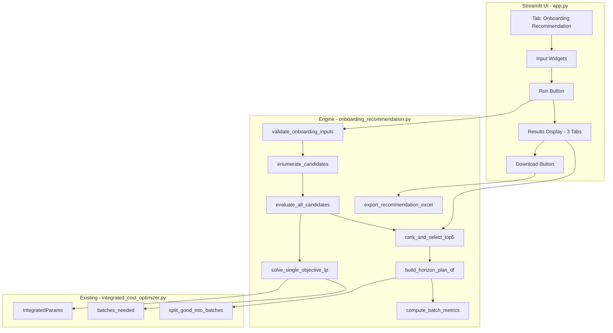

# Design Document — Onboarding Recommendation Engine

## Overview

The Onboarding Recommendation Engine is a new module added to the existing Production Cost Optimizer Streamlit application. Given a total number of generators to onboard and a candidate week range, it evaluates every possible start week by solving three independent Linear Programs (one per cost objective: penalty, overtime, capacity utilisation). For each objective it ranks all feasible candidates by ascending cost and presents the top 5 as side-by-side horizon plans with batch metrics. Results are displayed in three tabs and exportable to Excel.

The engine is implemented as a pure-logic Python module (`onboarding_recommendation.py`) with a thin Streamlit UI layer integrated into `app.py` as a new tab. It reuses `IntegratedParams`, `batches_needed()`, and `split_good_into_batches()` from `integrated_cost_optimizer.py`, and uses PuLP (already a project dependency) for LP solving.

### Key Design Decisions

1. **Separate module for engine logic** — All LP formulation, solving, ranking, and export logic lives in `onboarding_recommendation.py`. This keeps the Streamlit UI layer thin and makes the core logic independently testable without Streamlit stubs.
2. **PuLP for LP solving** — Consistent with the existing project dependency. Each LP is a simple continuous relaxation (weekly production as continuous variables, with integer rounding handled post-solve via `batches_needed()`).
3. **Three independent LPs per candidate** — Rather than a single multi-objective formulation, each objective is optimized in isolation. This gives the planner three distinct "best" perspectives to compare.
4. **Reuse of IntegratedParams** — All production constraints and cost rates come from the existing dataclass, ensuring consistency with the main optimizer.

## Architecture



### Data Flow

1. User enters total generators, start week, end week in the Streamlit UI tab.
2. `validate_onboarding_inputs()` checks constraints (positive integers, start < end).
3. `enumerate_candidates()` produces the list `[start_week, start_week+1, ..., end_week]`.
4. `evaluate_all_candidates()` iterates over candidates. For each candidate and each of the 3 objectives, it calls `solve_single_objective_lp()` which formulates and solves a PuLP LP.
5. `rank_and_select_top5()` sorts results per objective by ascending cost and picks the top 5.
6. `build_horizon_plan_df()` constructs a week-by-week DataFrame for each selected option.
7. `compute_batch_metrics()` counts weeks with 1, 2, or 3 batches using `batches_needed()`.
8. The UI renders three tabs with side-by-side columns. Export writes to Excel via `export_recommendation_excel()`.

## Components and Interfaces

### Module: `onboarding_recommendation.py`


#### `validate_onboarding_inputs(total_generators: int, start_week: int, end_week: int) -> list[str]`

Validates user inputs. Returns a list of error strings (empty if valid).

- `total_generators` must be >= 1
- `start_week` must be >= 1
- `end_week` must be > `start_week`

#### `enumerate_candidates(start_week: int, end_week: int) -> list[int]`

Returns `list(range(start_week, end_week + 1))`.

#### `solve_single_objective_lp(total_generators: int, candidate_start_week: int, horizon_end_week: int, objective: str, params: IntegratedParams) -> dict | None`

Formulates and solves a single PuLP LP for one candidate start week under one objective.

**Parameters:**
- `total_generators` — total good units to allocate
- `candidate_start_week` — first week of production
- `horizon_end_week` — last week of the allocation span (= end_week from user input)
- `objective` — one of `"penalty"`, `"overtime"`, `"capacity"`
- `params` — `IntegratedParams` instance

**LP Formulation (common constraints):**
- Decision variables: `y[t]` = good units produced in week `t`, continuous, `0 <= y[t] <= params.overtime_max_good_week` (45)
- Constraint: `sum(y[t] for t in span) == total_generators`

**Objective-specific formulation:**

- **Penalty (minimize early inventory holding):**
  - Auxiliary variable `inv[t]` = cumulative production up to week `t` minus cumulative "ideal" delivery. Since all generators are delivered at the end, early production incurs holding cost. We model `inv[t] = sum(y[1..t])` as cumulative production. The penalty is `penalty_rate * sum(inv[t] for t in span)` — minimizing total unit-weeks of inventory.
  
- **Overtime (minimize overtime weeks):**
  - Binary variable `ot[t]` for each week, with constraint `y[t] <= params.normal_max_good_week + (params.overtime_max_good_week - params.normal_max_good_week) * ot[t]`. Objective: `overtime_rate * sum(ot[t])`.
  - This is a Mixed-Integer LP (MILP) since `ot[t]` is binary. PuLP handles this with its default CBC solver.

- **Capacity (minimize unused capacity):**
  - Unused capacity per week = `params.normal_max_good_week - y[t]` when `y[t] <= normal_max_good_week`, else 0. We use auxiliary variables: `unused[t] >= normal_max_good_week - y[t]`, `unused[t] >= 0`. Objective: `capacity_rate * sum(unused[t])`.

**Returns:** `None` if infeasible, otherwise a dict:
```python
{
    "candidate_start_week": int,
    "objective": str,
    "cost": float,
    "weekly_production": list[float],  # y[t] values for each week in span
}
```

#### `evaluate_all_candidates(total_generators: int, start_week: int, end_week: int, params: IntegratedParams) -> dict[str, list[dict]]`

Iterates over all candidate start weeks and all 3 objectives. Returns:
```python
{
    "penalty": [result_dict, ...],
    "overtime": [result_dict, ...],
    "capacity": [result_dict, ...],
}
```
Infeasible candidates are excluded and logged via warnings.

#### `rank_and_select_top5(results: dict[str, list[dict]]) -> dict[str, list[dict]]`

For each objective key, sorts by ascending `cost` and returns the top 5 (or fewer if less than 5 feasible).

#### `build_horizon_plan_df(result: dict, start_week: int, end_week: int, params: IntegratedParams) -> pd.DataFrame`

Converts a single result dict into a week-by-week DataFrame with columns:
- `Week` — week number
- `Good_Units_Produced` — rounded integer good units
- `Batch_Count` — via `batches_needed()`
- `Cumulative_Production` — running total
- `Cumulative_Inventory` — cumulative production (units held before final delivery)

Weeks outside the candidate's production span show 0.

#### `compute_batch_metrics(plan_df: pd.DataFrame, params: IntegratedParams) -> dict`

Returns:
```python
{
    "weeks_1_batch": int,  # weeks with exactly 1 batch (1-15 good units)
    "weeks_2_batch": int,  # weeks with exactly 2 batches (16-30 good units)
    "weeks_3_batch": int,  # weeks with exactly 3 batches (31-45 good units)
}
```
Uses `batches_needed()` from `integrated_cost_optimizer.py`.

#### `format_cost_thousands(cost: float) -> str`

Formats a cost value as `"$XXK"` (e.g., `28000.0` → `"$28K"`).

#### `export_recommendation_excel(top5: dict[str, list[dict]], start_week: int, end_week: int, params: IntegratedParams) -> bytes`

Writes an in-memory Excel workbook with:
- One sheet per objective (`"Penalty"`, `"Overtime"`, `"Capacity"`) containing the top 5 horizon plans with week, good units, batch count, cumulative inventory.
- A `"Summary"` sheet with all three objectives' top 5 showing batch metrics and cost side-by-side.

Returns the workbook as bytes.

### UI Integration in `app.py`

The existing `app.py` gains a top-level tab structure:

```python
tab_optimizer, tab_onboarding = st.tabs(["Cost Optimizer", "Onboarding Recommendation"])
```

All existing optimizer UI moves under `tab_optimizer`. The `tab_onboarding` tab contains:
- Input widgets for total generators, start week, end week
- A "Run Recommendation" button
- Three sub-tabs for results: "Top 5 by Penalty", "Top 5 by Overtime", "Top 5 by Capacity Utilisation"
- Each sub-tab shows up to 5 columns, each with a horizon plan table and batch metrics
- A download button for the Excel export

## Data Models

### Input Data

| Field | Type | Constraints |
|---|---|---|
| `total_generators` | `int` | >= 1 |
| `start_week` | `int` | >= 1 |
| `end_week` | `int` | > `start_week` |

### LP Result (per candidate per objective)

```python
@dataclass
class LPResult:
    candidate_start_week: int
    objective: str          # "penalty" | "overtime" | "capacity"
    cost: float             # objective cost value
    weekly_production: list[float]  # good units per week across the span
```

### Ranked Option (enriched for display)

```python
@dataclass
class RankedOption:
    rank: int
    candidate_start_week: int
    objective: str
    cost: float
    plan_df: pd.DataFrame       # week-by-week horizon plan
    batch_metrics: dict          # {"weeks_1_batch": int, "weeks_2_batch": int, "weeks_3_batch": int}
    formatted_cost: str          # e.g. "$28K"
```

### Reused from `integrated_cost_optimizer.py`

- `IntegratedParams` — all production constraints and cost rates
- `batches_needed(good_units, params) -> int`
- `split_good_into_batches(good_units, params) -> list[int]`


## Correctness Properties

*A property is a characteristic or behavior that should hold true across all valid executions of a system — essentially, a formal statement about what the system should do. Properties serve as the bridge between human-readable specifications and machine-verifiable correctness guarantees.*

### Property 1: Invalid inputs are rejected

*For any* input triple where `total_generators < 1` OR `start_week < 1` OR `start_week >= end_week`, `validate_onboarding_inputs()` should return a non-empty error list.

**Validates: Requirements 1.2, 1.3**

### Property 2: Valid inputs produce no errors

*For any* input triple where `total_generators >= 1` AND `start_week >= 1` AND `end_week > start_week`, `validate_onboarding_inputs()` should return an empty error list.

**Validates: Requirements 1.4**

### Property 3: Candidate enumeration is complete and correct

*For any* valid `start_week` and `end_week` (with `end_week > start_week`), `enumerate_candidates(start_week, end_week)` should return exactly `end_week - start_week + 1` integers, each in `[start_week, end_week]`, in ascending order with no duplicates.

**Validates: Requirements 2.1**

### Property 4: LP solutions satisfy production constraints

*For any* feasible LP result (any objective, any candidate start week), the weekly production values must satisfy: (a) no week exceeds `params.overtime_max_good_week` (45), (b) no week is negative, and (c) the sum of all weekly production equals `total_generators`.

**Validates: Requirements 2.2, 3.3, 3.4**

### Property 5: All three objectives are evaluated

*For any* feasible set of inputs, `evaluate_all_candidates()` should return a dict with exactly three keys: `"penalty"`, `"overtime"`, `"capacity"`.

**Validates: Requirements 3.1**

### Property 6: Reported cost matches independent computation

*For any* LP result, the reported `cost` value must equal the cost independently computed from the `weekly_production` array using the corresponding objective's formula: penalty = `penalty_rate * sum(cumulative_inventory)`, overtime = `overtime_rate * count(weeks > normal_max_good_week)`, capacity = `capacity_rate * sum(max(0, normal_max_good_week - y[t]) for t in span)`.

**Validates: Requirements 3.5, 3.6, 3.7**

### Property 7: Infeasible candidates are excluded

*For any* candidate start week where `total_generators > (end_week - candidate_start_week + 1) * params.overtime_max_good_week`, the candidate should not appear in any objective's result list.

**Validates: Requirements 3.8**

### Property 8: Rankings are sorted ascending by cost and capped at 5

*For any* objective's result list, `rank_and_select_top5()` should return results sorted in non-decreasing order of `cost`, with length `min(5, len(feasible_results))`.

**Validates: Requirements 4.1, 4.2, 4.3, 4.4, 4.5**

### Property 9: Horizon plan DataFrame structure and zero-fill

*For any* result and week range `[start_week, end_week]`, `build_horizon_plan_df()` should produce a DataFrame with one row per week from `start_week` to `end_week`, containing columns `Week` and `Good_Units_Produced`. Weeks before the candidate's start week must have `Good_Units_Produced == 0`.

**Validates: Requirements 5.3, 5.5**

### Property 10: Batch metrics match independent computation

*For any* horizon plan DataFrame, `compute_batch_metrics()` should return counts where `weeks_1_batch + weeks_2_batch + weeks_3_batch` equals the number of weeks with non-zero production, and each count matches the result of applying `batches_needed()` to each week's good units.

**Validates: Requirements 6.1, 6.2, 6.3**

### Property 11: Cost formatting produces correct $XK string

*For any* non-negative float cost value, `format_cost_thousands(cost)` should produce a string matching the pattern `"$<integer>K"` where the integer equals `round(cost / 1000)`.

**Validates: Requirements 6.4, 6.5, 6.6**

### Property 12: Export produces valid Excel with correct structure

*For any* valid top-5 results dict (with 1–5 options per objective), `export_recommendation_excel()` should return non-empty bytes that parse as a valid Excel workbook containing sheets named `"Penalty"`, `"Overtime"`, `"Capacity"`, and `"Summary"`.

**Validates: Requirements 8.2, 8.3**

## Error Handling

| Scenario | Handling |
|---|---|
| `total_generators < 1` | `validate_onboarding_inputs()` returns error; UI shows `st.error()`, run button disabled |
| `start_week >= end_week` | Same as above |
| `start_week < 1` | Same as above |
| LP infeasible for a candidate | Candidate excluded from results; warning logged via `warnings.warn()` |
| All candidates infeasible | All three objective lists empty; UI displays info message "No feasible onboarding schedule found" |
| PuLP solver error | Caught in `solve_single_objective_lp()`, returns `None`, candidate treated as infeasible |
| Zero feasible options for one objective but not others | That objective's tab shows "No feasible options" message; other tabs render normally |
| Excel export with empty results | Export still produces a valid workbook with empty sheets and a summary noting zero options |

## Testing Strategy

### Property-Based Testing

The project already uses **Hypothesis** (>= 6.100.0) for property-based testing, as seen in `tests/test_app_properties.py`. All 12 correctness properties above will be implemented as Hypothesis property tests in a new file `tests/test_onboarding_properties.py`.

Each test will:
- Run a minimum of **100 iterations** (`@settings(max_examples=100)`)
- Be tagged with a comment referencing the design property: `# Feature: onboarding-recommendation, Property N: <title>`
- Use `@given` decorators with appropriate strategies for generating random valid/invalid inputs

**Key Strategies:**
- `st.integers(min_value=1, max_value=500)` for `total_generators`
- `st.integers(min_value=1, max_value=52)` for week numbers (with filtering for start < end)
- Custom composite strategies for generating `IntegratedParams` instances (reuse `_valid_params_strategy` pattern from existing tests)
- `st.lists()` of result dicts for ranking tests
- `st.floats(min_value=0.0, ...)` for cost values in formatting tests

### Unit Tests

Unit tests in `tests/test_onboarding.py` will cover:
- Specific examples: e.g., 30 generators from week 1–10 should produce known feasible results
- Edge cases: 1 generator (trivial), generators exactly filling capacity, start_week == 1
- Integration: verify `batches_needed()` is correctly called within `compute_batch_metrics()`
- Excel export: verify specific sheet contents for a known small input

### Test Organization

```
tests/
  test_onboarding.py              # Unit tests for specific examples and edge cases
  test_onboarding_properties.py   # Property-based tests for all 12 correctness properties
```

Both test files import from `onboarding_recommendation.py` directly (no Streamlit dependency), leveraging the existing `conftest.py` Streamlit stub for any tests that need to import `app.py`.
