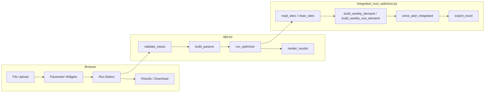
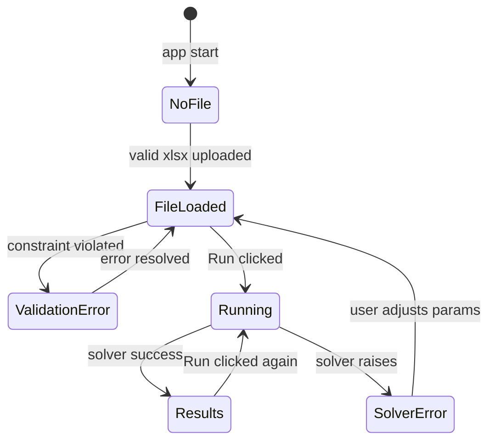

# Design Document: Streamlit Cost Optimizer UI

## Overview

A single-file Streamlit application (`app.py`) that wraps `integrated_cost_optimizer.py`.
Users upload an Excel workbook, configure all `IntegratedParams` fields through interactive
widgets, trigger the DP solver, view a results summary and plan table in the browser, and
download the output Excel file — all without touching the command line.

The app is intentionally thin: it owns only UI state and I/O bridging. All business logic
(validation, solving, export) stays in the existing optimizer module.



---

## Architecture

The app follows a **linear Streamlit script** pattern: the script re-runs top-to-bottom on
every widget interaction. State that must survive re-runs (uploaded bytes, last run results)
is stored in `st.session_state`.

Key design decisions:

- **No disk I/O**: the uploaded file is kept as `BytesIO`; `export_excel` normally writes to
  a path, so we monkey-patch it to write into a `BytesIO` buffer instead (see Components).
- **Validation before run**: all parameter constraints are checked eagerly on every re-run;
  the Run button is disabled (`disabled=True`) when any error exists.
- **Single module**: everything lives in `app.py` to keep deployment simple (one file to
  deploy alongside `integrated_cost_optimizer.py`).



---

## Components and Interfaces

### 1. `validate_inputs(params_dict, file_bytes, sheet_name, shutdown_str, partial_str) -> list[str]`

Pure function. Returns a list of human-readable error strings (empty = all valid).

Checks:
- File uploaded and parseable as Excel
- Sheet name exists in workbook
- `max_batch_produced >= min_batch_produced`
- `overtime_max_batches >= normal_max_batches`
- All three weights not simultaneously zero
- Shutdown / partial-shutdown strings parse as positive integers
- Week numbers in shutdown lists do not exceed `horizon_weeks` (warning, not error)

### 2. `parse_week_list(text: str) -> tuple[list[int], str | None]`

Parses a comma-separated week string. Returns `(parsed_list, error_message_or_None)`.
Mirrors `_parse_week_list` in the optimizer but also validates each token is a positive integer.

### 3. `build_params(widget_values: dict) -> IntegratedParams`

Constructs an `IntegratedParams` from the collected widget values. Called only after
`validate_inputs` returns no errors.

### 4. `run_optimizer(file_bytes, sheet_name, params, shutdown_weeks, partial_weeks) -> tuple[pd.DataFrame, pd.DataFrame, pd.DataFrame, dict, bytes]`

Orchestrates the full optimizer pipeline:
1. `read_sites` from `BytesIO`
2. `clean_sites`
3. `build_weekly_demand` + `build_weekly_row_demand`
4. `solve_plan_integrated`
5. `export_excel` into a `BytesIO` buffer

Returns `(plan_df, active_df, issues_df, summary, xlsx_bytes)`.

### 5. `render_results(summary, plan_df, issues_df, xlsx_bytes)`

Renders the results section: metric cards, interactive `st.dataframe`, collapsible issues
section, and the download button.

### 6. `read_sites` adapter

`integrated_cost_optimizer.read_sites` accepts a file path string. We pass it a `BytesIO`
object directly — `pd.read_excel` accepts file-like objects, so this works without patching.

### 7. `export_excel` adapter

`export_excel` writes to a path string. We wrap it:

```python
def export_excel_bytes(plan_df, active_df, issues_df, params, summary) -> bytes:
    buf = io.BytesIO()
    with pd.ExcelWriter(buf, engine="openpyxl") as writer:
        # same sheet writes as export_excel
        ...
    return buf.getvalue()
```

This avoids any temp-file creation.

---

## Data Models

### Session State Schema

```python
st.session_state = {
    # Set when a valid file is uploaded
    "file_bytes": bytes | None,
    "sheet_names": list[str] | None,

    # Set after a successful run
    "last_plan_df": pd.DataFrame | None,
    "last_active_df": pd.DataFrame | None,
    "last_issues_df": pd.DataFrame | None,
    "last_summary": dict | None,
    "last_xlsx_bytes": bytes | None,
}
```

### `IntegratedParams` (existing, unchanged)

```python
@dataclass(frozen=True)
class IntegratedParams:
    horizon_weeks: int = 52
    min_batch_produced: int = 2
    max_batch_produced: int = 16
    test_discard_per_batch: int = 1
    normal_max_batches: int = 2
    overtime_max_batches: int = 3
    penalty_rate: float = 7000.0
    late_penalty_multiplier: float = 100.0
    overtime_rate: float = 2000.0
    capacity_rate: float = 15000.0
    w_penalty: float = 1.0
    w_overtime: float = 1.0
    w_capacity: float = 1.0
    row_cap: int = 2
```

### Summary dict (returned by `solve_plan_integrated`)

```python
{
    "total_composite_cost": float,
    "total_penalty_cost": float,
    "total_overtime_cost": float,
    "total_capacity_cost": float,
    "overtime_weeks": int,
    "w_penalty": float,
    "w_overtime": float,
    "w_capacity": float,
}
```

### Validation Error List

```python
errors: list[str]   # human-readable messages; empty = valid
warnings: list[str] # non-blocking notices (e.g. week > horizon)
```

---

## Correctness Properties

*A property is a characteristic or behavior that should hold true across all valid executions of a system — essentially, a formal statement about what the system should do. Properties serve as the bridge between human-readable specifications and machine-verifiable correctness guarantees.*

### Property 1: Invalid file bytes rejected

*For any* byte sequence that is not a valid Excel workbook, `validate_inputs` must return a non-empty error list.

**Validates: Requirements 1.4**

---

### Property 2: Missing sheet name rejected

*For any* valid Excel workbook and any sheet name string that does not appear in that workbook's sheet list, `validate_inputs` must return a non-empty error list containing a sheet-related error.

**Validates: Requirements 2.3**

---

### Property 3: Batch size cross-field validation

*For any* pair of integers where `max_batch_produced < min_batch_produced`, `validate_inputs` must return a non-empty error list containing a batch-size error.

**Validates: Requirements 3.8**

---

### Property 4: Overtime batch cross-field validation

*For any* pair of integers where `overtime_max_batches < normal_max_batches`, `validate_inputs` must return a non-empty error list containing an overtime-batch error.

**Validates: Requirements 3.9**

---

### Property 5: Late penalty rate is always penalty_rate × late_penalty_multiplier

*For any* non-negative `penalty_rate` and any `late_penalty_multiplier >= 1.0`, the derived `late_penalty_rate` displayed in the UI must equal `penalty_rate * late_penalty_multiplier`.

**Validates: Requirements 4.5**

---

### Property 6: Non-integer shutdown week entries produce parse errors

*For any* comma-separated string containing at least one token that is not a valid positive integer, `parse_week_list` must return a non-None error message.

**Validates: Requirements 6.4**

---

### Property 7: Out-of-range shutdown weeks produce warnings

*For any* week number that exceeds `horizon_weeks`, `validate_inputs` must include a warning (non-blocking) for that week number.

**Validates: Requirements 6.5**

---

### Property 8: Successful run summary contains all required fields

*For any* valid input file and parameter set that produces a successful optimizer run, the returned `summary` dict must contain all of: `total_composite_cost`, `total_penalty_cost`, `total_overtime_cost`, `total_capacity_cost`, `overtime_weeks` — each with a numeric value.

**Validates: Requirements 8.1, 8.2, 8.3, 8.4**

---

### Property 9: Export produces non-empty bytes

*For any* valid optimizer run result (plan_df, active_df, issues_df, params, summary), `export_excel_bytes` must return a non-empty bytes object that can be parsed as a valid Excel workbook.

**Validates: Requirements 9.1**

---

### Property 10: All active validation errors appear in the error list

*For any* combination of invalid inputs, every violated constraint must produce a distinct entry in the error list returned by `validate_inputs` — no constraint violation is silently swallowed.

**Validates: Requirements 10.2**

---

## Error Handling

| Scenario | Handling |
|---|---|
| Uploaded file is not valid Excel | `validate_inputs` catches `Exception` from `pd.ExcelFile`; adds error to list; Run button disabled |
| Selected sheet missing from workbook | `validate_inputs` checks `sheet_names`; adds error; Run button disabled |
| `max_batch < min_batch` | Cross-field check in `validate_inputs`; descriptive error shown inline |
| `overtime_batches < normal_batches` | Cross-field check in `validate_inputs`; descriptive error shown inline |
| All weights = 0.0 | `validate_inputs` catches this before constructing `IntegratedParams`; error shown |
| Shutdown week parse failure | `parse_week_list` returns error string; shown inline; Run disabled |
| `solve_plan_integrated` raises `RuntimeError` | Caught in `run_optimizer`; displayed via `st.error`; results state cleared |
| Any unexpected exception during run | Caught broadly; displayed via `st.error`; results state cleared |
| `export_excel_bytes` fails | Caught in `run_optimizer`; displayed via `st.error`; download button not shown |

All errors are surfaced to the user with descriptive messages. No exceptions propagate to the Streamlit top-level error page during normal operation.

---

## Testing Strategy

### Dual Testing Approach

Both unit tests and property-based tests are required. They are complementary:
- Unit tests cover specific examples, integration points, and edge cases.
- Property tests verify universal correctness across randomized inputs.

### Unit Tests (pytest)

Focus areas:
- `parse_week_list`: empty string, valid list, non-integer token, negative integer, zero
- `validate_inputs`: each individual error condition in isolation
- `build_params`: correct mapping of widget dict to `IntegratedParams` fields
- `export_excel_bytes`: output is valid Excel with expected sheet names
- Session state clearing on second run
- Download filename is `"plan_output.xlsx"`
- Issues_DF section rendered after successful run

### Property-Based Tests (Hypothesis, minimum 100 iterations each)

Each property test maps directly to a Correctness Property above.

```
# Feature: streamlit-cost-optimizer-ui, Property 1: Invalid file bytes rejected
@given(st.binary().filter(lambda b: not is_valid_excel(b)))
def test_invalid_file_rejected(bad_bytes): ...

# Feature: streamlit-cost-optimizer-ui, Property 2: Missing sheet name rejected
@given(valid_workbook_bytes(), sheet_name_not_in_workbook())
def test_missing_sheet_rejected(wb_bytes, sheet_name): ...

# Feature: streamlit-cost-optimizer-ui, Property 3: Batch size cross-field validation
@given(st.integers(1,16), st.integers(1,16))
def test_batch_size_validation(min_b, max_b):
    assume(max_b < min_b)
    assert validate_inputs(...) != []

# Feature: streamlit-cost-optimizer-ui, Property 4: Overtime batch cross-field validation
@given(st.integers(1,5), st.integers(1,5))
def test_overtime_batch_validation(normal, overtime):
    assume(overtime < normal)
    assert validate_inputs(...) != []

# Feature: streamlit-cost-optimizer-ui, Property 5: Late penalty rate derived correctly
@given(st.floats(0, 1e6), st.floats(1.0, 1000.0))
def test_late_penalty_rate(penalty_rate, multiplier):
    assert compute_late_penalty_rate(penalty_rate, multiplier) == penalty_rate * multiplier

# Feature: streamlit-cost-optimizer-ui, Property 6: Non-integer shutdown entries produce errors
@given(invalid_week_list_strings())
def test_invalid_shutdown_parse(text):
    _, err = parse_week_list(text)
    assert err is not None

# Feature: streamlit-cost-optimizer-ui, Property 7: Out-of-range weeks produce warnings
@given(st.integers(1, 104), st.integers(1, 104))
def test_out_of_range_week_warning(horizon, week):
    assume(week > horizon)
    _, warnings = validate_inputs(..., horizon_weeks=horizon, shutdown_str=str(week))
    assert any(str(week) in w for w in warnings)

# Feature: streamlit-cost-optimizer-ui, Property 8: Summary contains all required fields
@given(valid_optimizer_inputs())
def test_summary_fields(inputs):
    _, summary = run_optimizer(*inputs)
    for key in ["total_composite_cost","total_penalty_cost","total_overtime_cost",
                "total_capacity_cost","overtime_weeks"]:
        assert key in summary and isinstance(summary[key], (int, float))

# Feature: streamlit-cost-optimizer-ui, Property 9: Export produces valid Excel bytes
@given(valid_optimizer_inputs())
def test_export_produces_valid_excel(inputs):
    xlsx = export_excel_bytes(...)
    assert len(xlsx) > 0
    wb = openpyxl.load_workbook(io.BytesIO(xlsx))
    assert "Weekly_Plan" in wb.sheetnames

# Feature: streamlit-cost-optimizer-ui, Property 10: All errors appear in error list
@given(invalid_param_combinations())
def test_all_errors_reported(params):
    errors = validate_inputs(params)
    assert len(errors) >= count_violations(params)
```

### Property-Based Testing Library

Use **Hypothesis** (`pip install hypothesis`). Configure each test with `@settings(max_examples=100)`.
